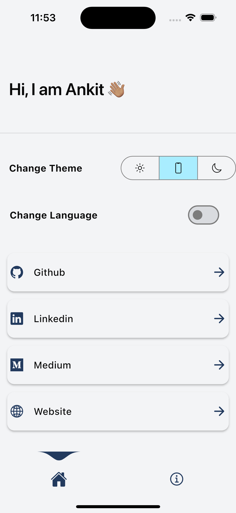
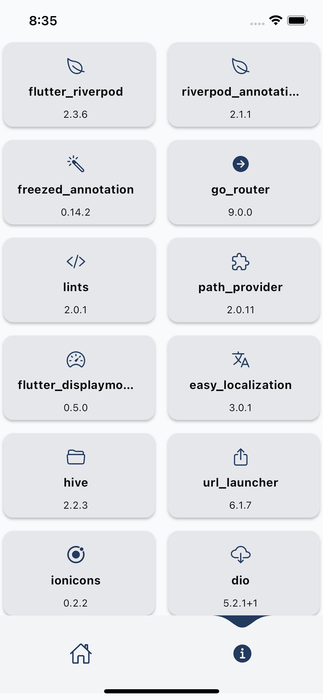
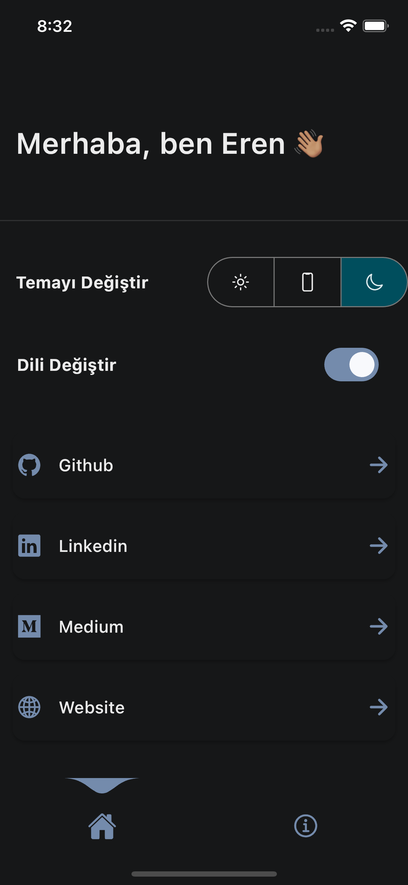
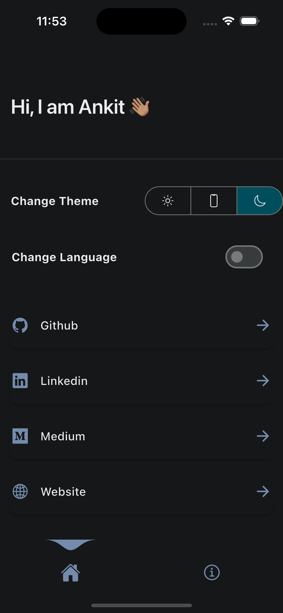
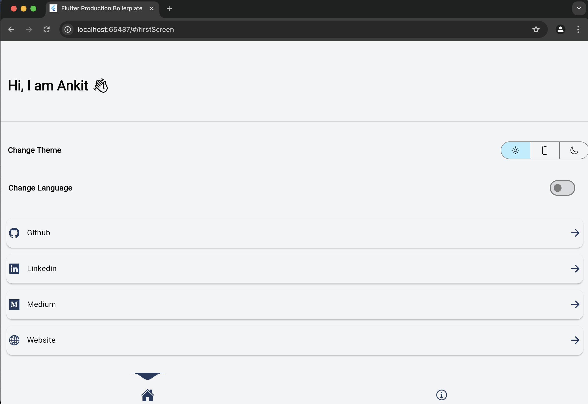
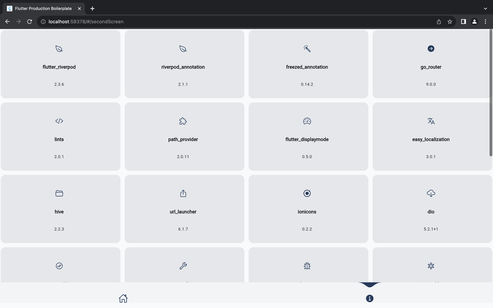
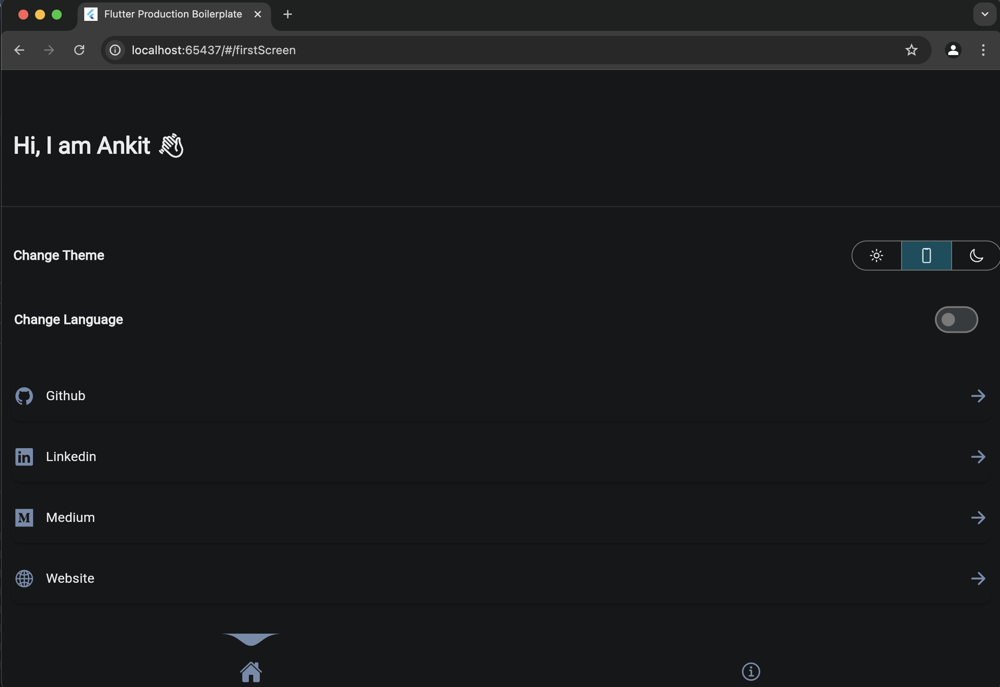
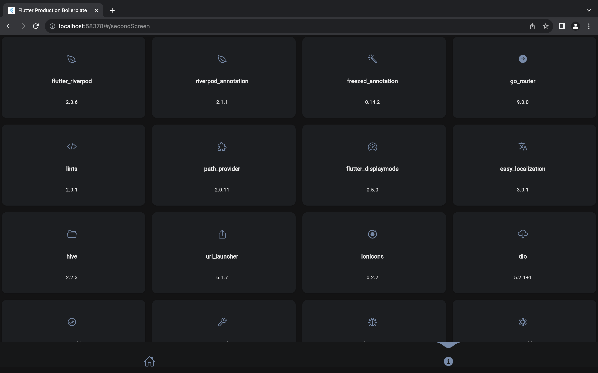

# Flutter Riverpod 2.0 Template

## A cutting-edge Flutter template with Riverpod 2.0, Freezed, Go Router, Hive, Easy Localization, and more!

This template is the perfect launchpad for your Flutter application. It's packed with useful packages and best practices, making it an ideal starting point for both beginners and experienced developers.

🚀 Kickstart your Flutter project with:
- Riverpod 2.0 for efficient state management
- Freezed annotations for immutable state
- Go Router for smooth navigation with fade and slide transitions
- Flutter Lints for stricter code quality
- Hive for cross-platform storage (including web)
- And much more!

## 📦 Pub Packages

| Package | Version | Usage |
|---------|---------|-------|
| [Flutter Riverpod](https://pub.dev/packages/flutter_riverpod) | ^2.3.6 | State management* |
| [Riverpod Annotation](https://pub.dev/packages/riverpod) | ^1.0.3 | State management* |
| [Freezed Annotation](https://pub.dev/packages/freezed_annotation) | ^0.14.2 | Immutable state* |
| [Go Router](https://pub.dev/packages/go_router) | ^14.0.2 | Routing |
| [Get It](https://pub.dev/packages/get_it) | ^7.2.0 | Dependency injection* |
| [Flutter Lints](https://pub.dev/packages/flutter_lints) | ^4.0.0 | Stricter linting rules |
| [Path Provider](https://pub.dev/packages/path_provider) | ^2.0.11 | Get the save path for Hive |
| [Flutter Displaymode](https://pub.dev/packages/flutter_displaymode) | ^0.5.0 | Support high refresh rate displays |
| [Easy Localization](https://pub.dev/packages/easy_localization) | ^3.0.1 | Makes localization easy |
| [Hive](https://pub.dev/packages/hive) | ^2.2.3 | Platform independent storage |
| [Url Launcher](https://pub.dev/packages/url_launcher) | ^6.1.7 | Open URLs in Browser |
| [Ionicons](https://pub.dev/packages/ionicons) | ^0.2.2 | Modern icon library |

> \* Recommended to keep regardless of your project

## 🚀 Getting Started

1. Clone this repository
2. Run `flutter pub get` to install dependencies
3. Run `dart run build_runner build` to generate providers
4. Start building your amazing app!

## 📁 Feature-First Folder Structure

```
lib/
┣ common/
┃ ┣ bottom_nav_bar/
┃ ┣ app_bar_gone.dart
┃ ┣ grid_item.dart
┃ ┗ link_card.dart
┣ config/
┃ ┗ theme/
┣ constants/
┃ ┣ endpoints.dart
┃ ┗ strings.dart
┣ data/
┃ ┣ enums/
┃ ┣ getstore/
┃ ┣ hive/
┃ ┣ models/
┃ ┗ repository/
┣ di/
┃ ┣ components/
┃ ┗ module/
┣ exceptions/
┣ features/
┃ ┣ home/
┃ ┗ info/
┣ localization/
┣ router/
┃ ┣ app_router.dart
┃ ┣ fade_extension.dart
┃ ┗ slide_extension.dart
┣ utils/
┃ ┣ context_extensions.dart
┃ ┗ url_utils.dart
┣ main.dart
┗ my_app.dart
}
```

## 🛠 Customization

### Theming
Customize your brand colors in `lib/config/theme.dart`. The project uses colors from [FlexColorScheme](https://rydmike.com/flexcolorscheme/themesplayground-v7-2/).

### Localization
Add new languages by creating a folder in `assets/translations/` with the language code (e.g., "en" for English). Include a `language.json` file with your translations.

### Routing
Define routes in `lib/config/router/app_router.dart` using Go Router.

## 📸 Screenshots

<details>
<summary>Click to view screenshots</summary>

### Light Theme
| Home | Info |
|------|------|
|  |  |

### Dark Theme
| Home | Info |
|------|------|
|  |  |

### Web
| Home Light | Info Light |
|------------|------------|
|  |  |

| Home Dark | Info Dark |
|-----------|-----------|
|  |  |

</details>

## 🔧 FAQs

<details>
<summary>How do I manage state with Riverpod annotations and Freezed?</summary>

1. Create a freezed UI model class
2. Create a logic class with Riverpod annotations
3. Run build_runner to generate providers
4. Use the provider in your widgets

See the README for detailed examples.
</details>

<details>
<summary>How can I make the state persistent?</summary>

Use Hive or another storage solution in conjunction with your state management. See the theme state example in the README for implementation details.
</details>

<details>
<summary>How do I add new routes?</summary>

1. Define the route in the SGORouter enum
2. Add the route to the GoRouter configuration
3. Use `context.go(SGRoute.your_route_name.route)` to navigate

</details>

## 📝 Todo List

- [x] Implement Riverpod 2.0 state management
- [x] Set up Go Router for navigation
- [x] Integrate Hive for local storage
- [x] Add Easy Localization support
- [x] Create a feature-first folder structure
- [x] Create another separate branch for graphQL
- [x] Implemented graphQL interceptor layer.
- [ ] Implemented rest interceptor layer using dio.
- [ ] Write tests for logic classes
- [ ] Add more examples for API call handling
- [ ] Expand documentation and comments
- [ ] Create a contributor page in the app
- [ ] Establish contribution guidelines

## 🤝 Contributing

We welcome contributions! Feel free to add language support, create examples, or improve documentation. For major changes, please open an issue first to discuss what you would like to change.

## 📄 License

This project is licensed under the [MIT License](./LICENSE.md).

## 📬 Contact

For any questions or suggestions, please reach out to the project maintainer at https://www.erengun.dev

---

Help us make this template even better! Star ⭐ the repo if you like it, and happy coding! 🚀
